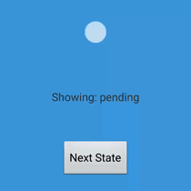

# MultiStateAnimation

Android library to create complex multi-state animations.



## Overview

A class that allows for complex multi-state animations using Android's
`AnimationDrawable`. It supports both oneshot and looped animation sections.
Transitions between sections can be defined, and will play automatically when
moving between the defined states. State transitions can be queued
asynchronously, and the library will take car of smoothly starting the next
animation once the current section is complete.

## Installation

Add the following dependency to your gradle build file:
```gradle
    dependencies {  
        compile 'com.getkeepsafe.android.multistateanimation:library:1.1.1'
    }
```
## Usage
Each animation consists of a series of states. A state has some metadata and a list
of frames to draw. A state can also define transitions from other states. A
transition is a list of frames that will be played when moving directly from a
specified state to the state where the transition is defined.

An animation can be defined either with a JSON file included as a `raw` resource, 
or directly in Java code using builders.

### Defining an animation with Java code

```java

    // The ID is used in code to specify a section to play
    MultiStateAnimation.SectionBuilder firstSection = new MultiStateAnimation.SectionBuilder("first_section")
        // If true, this section will play once and stop. Otherwise it
        // will loop indefinitely.
        .setOneshot(false)
        // The number of milliseconds that each frame of this section will
        // play
        .setFrameDuration(33)
        // Each frame is the name of an image resource. They will be
        // played in the order added.
        .addFrame(R.drawable.first_section_01)
        .addFrame(R.drawable.first_section_02);

    // The frames of a transition will be played before playing
    // the normal frames of this section when transitioning. In
    // this case, the frames for this transition will play if
    // "first_section" is playing when queueTransition("second_section") 
    // is called
    MultiStateAnimation.TransitionBuilder transitionFromFirst = new MultiStateAnimation.TransitionBuilder()
        .setFrameDuration(33)
        .addFrame(R.drawable.first_to_second_transition_001)
        .addFrame(R.drawable.first_to_second_transition_002)
        .addFrame(R.drawable.first_to_second_transition_003);

    // As a special case, a transition ID of "" is a transition
    // from nothing. It will play if the associated section is the
    // first to ever play.
    MultiStateAnimation.TransitionBuilder transitionFromNothing = new MultiStateAnimation.TransitionBuilder()
        .addFrame(R.drawable.nothing_to_second_001)
        .addFrame(R.drawable.nothing_to_second_002);

    // A section with a single frame and "oneshot" set to true is
    // equivalent to a static image
    MultiStateAnimation.SectionBuilder secondSection = new MultiStateAnimation.SectionBuilder("second_section")
        .setOneshot(true)
        .addTransition("first_section", transitionFromFirst)
        .addTransition("", transitionFromNothing)
        .addFrame(R.drawable.second_section_01);

    // Animation should be given an View that will be used to display the animation.
    ImageView view = (ImageView) findViewById(R.id.animationImageView);
    MultiStateAnimation animation = new MultiStateAnimation.Builder(view)
        .addSection(startSection)
        .addSection(loadingSection)
        .addSection(endSection)
        .build(context);

```

### Defining an animation using JSON

As an alternative to using Java code, you can instead define animations using a JSON file stored as a raw resource. The following JSON file defines the same animation as the above Java code.

```javascript

    {
        "first_section": { 
            "oneshot": false, 
            "frame_duration": 33, 
            "frames": [
                "first_section_1",
                "first_section_2"
            ],
    
        }
    
        "second_section": {
            "oneshot": true,
            "frames": [
                "second_section_01"
            ],
            "transitions_from": {
                "first_section": {
                    "frame_duration": 33,
                    "frames": [
                            "first_to_second_transition_001",
                            "first_to_second_transition_002",
                            "first_to_second_transition_003"
                    ]
                }
                "": {
                    "frames": [
                        "nothing_to_second_001",
                        "nothing_to_second_002"
                    ]
                }
            }
        }
    }

```

Then a `MultiStateAnimationOjbect` can be created in Java:

```java

    ImageView view = (ImageView) findViewById(R.id.animationImageView);
    MultiStateAnimation animationSeries = MultiStateAnimation.fromJsonResource(context, view, R.raw.sample_animation);

```

#### Generating JSON animation files automatically

Included in the repo is a [Python 3 script](scripts/generate_animation_json.py) that can assist in generating the JSON for an animation. To use it, place the frames for each section of the animation in a separate folder, the pass those folders to the script.

For example, to generate the JSON file above, create a folder structure like this:
```bash
    .
    ├── first_section
    │   ├── first_section_1.png
    │   └── first_section_2.png
    ├── first_to_second_transition
    │   ├── first_to_second_transition_001.png
    │   ├── first_to_second_transition_002.png
    │   └── first_to_second_transition_003.png
    ├── nothing_to_second_transition
    │   ├── nothing_to_second_001.png
    │   └── nothing_to_second_002.png
    └── second_section
        └── second_section_01.png
```
These folders can be located anywhere in your filesystem. To generate the JSON file, run the script with the folders as arguments:
```bash
    python generate_animation_json.py first_section/ second_section/ first_to_second_transition/ nothing_to_second_transition/ --output=sample_animation.json
```
The script will ask a series of questions about each section, and save the resulting json file to `sample_animation.json`. You can run `python generate_animation_json.py --help` to see a full list of arguments

### Playing animations

Once the animation object is created via one of the above methods, you can use `queueTransition` and `transitionNow` 
from the GUI thread to start playing the animations.

```java

    animationSeries.queueTransition("first_section");
    
```

## Sample application

See the [main Activity](samples/src/main/java/com/getkeepsafe/android/multistateanimation/samples/ThreeStateSampleActivity.java) and the [json animation definition](samples/res/raw/sample_animation.json)
 in the [sample application](samples/) for an example.

## Java API

Check out [the Javadocs](http://keepsafe.github.io/MultiStateAnimation/) for more API details.

## License

    Copyright 2016 KeepSafe Inc.

    Licensed under the Apache License, Version 2.0 (the "License");
    you may not use this file except in compliance with the License.
    You may obtain a copy of the License at

       http://www.apache.org/licenses/LICENSE-2.0

    Unless required by applicable law or agreed to in writing, software
    distributed under the License is distributed on an "AS IS" BASIS,
    WITHOUT WARRANTIES OR CONDITIONS OF ANY KIND, either express or implied.
    See the License for the specific language governing permissions and
    limitations under the License.
